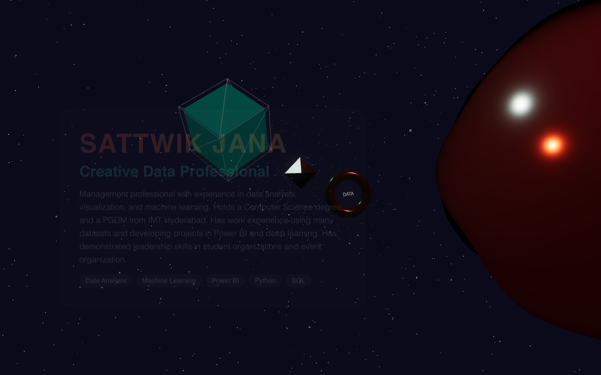

# Sattwik Jana — 3D Portfolio

An interactive 3D portfolio built with React Three Fiber, featuring a scroll-driven cinematic experience through a starfield universe.

## Live Demo

> Run locally with `npm run dev` — opens at `http://localhost:5173`

## Screenshots

### Home — Hero Section


## About the Project

This portfolio is a fully immersive 3D web experience built using React and Three.js. As you scroll, the camera flies through a deep-space environment, passing by floating 3D objects that represent different sections of the portfolio — Home, Education, Projects, and Contact.

Each section is rendered as an HTML overlay on top of the 3D canvas using `@react-three/drei`'s `<Scroll html>` component, giving it a glassmorphism UI feel layered over the 3D world.

### Key Features

- Scroll-driven 3D camera animation through a starfield
- Glassmorphism UI panels with Framer Motion entrance animations
- Floating 3D geometry nodes (sphere, cube, torus, octahedron) as section markers
- 300-particle path system guiding the viewer through the scene
- Fully responsive layout

### Sections

- **Home** — Introduction, skills, and a brief bio
- **Education & Journey** — IMT Hyderabad (PGDM) and MNNIT Allahabad (B.Tech CSE), plus leadership roles
- **Featured Projects** — Brain Tumor Classification CNN (95.8% accuracy) and 2011 Census Analysis with SQL + Power BI
- **Contact** — Email, phone, and GitHub links

## Tech Stack

| Technology | Purpose |
|---|---|
| React 19 | UI framework |
| Three.js + React Three Fiber | 3D rendering |
| @react-three/drei | 3D helpers (Stars, Float, ScrollControls, Text) |
| Framer Motion | HTML overlay animations |
| Lucide React | Icons |
| Vite | Build tool |

## Getting Started

```bash
# Install dependencies
npm install

# Start development server
npm run dev

# Build for production
npm run build
```

## Project Structure

```
src/
├── components/
│   ├── Experience.jsx   # 3D scene — camera rig, geometry nodes, particles
│   └── Overlay.jsx      # HTML sections rendered over the canvas
├── App.jsx              # Canvas setup with ScrollControls
├── index.css            # Global styles and glassmorphism theme
└── main.jsx             # Entry point
```

## Author

**Sattwik Jana**
- GitHub: [@Sattwikjana](https://github.com/Sattwikjana)
- Email: sattwikjana77@gmail.com
- LinkedIn: [sattwik-jana](https://www.linkedin.com/in/sattwik-jana/)
